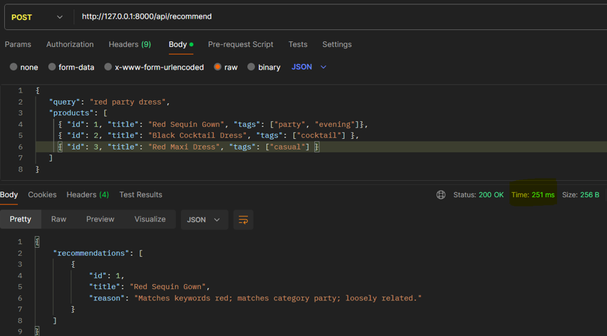

# How to run the code 
docker compose up -d
uv run uvicorn main:server --reload

# set environment varaibles 

## Environment Setup

Create a `.env` file in the root directory:
OPENAI_API_KEY='your open ai api key'
REDIS_URL='redis://localhost:6379/0'

# FAST API request and response 
Use something like Postman to Test URL

Post Request URL : http://127.0.0.1:8000/api/recommend

INPUT body (JSON)

{
   "query": "red party dress",
   "products": [
     { "id": 1, "title": "Red Sequin Gown", "tags": ["party", "evening"]
},
     { "id": 2, "title": "Black Cocktail Dress", "tags": ["cocktail"] },
     { "id": 3, "title": "Red Maxi Dress", "tags": ["casual"] }
   ]
}

# Project Structure 

.

├── providers/              # External API integrations (AI & Embeddings)
│   ├── openai_embedding_provider.py    # OpenAI-specific embedding logic 
│   └── ...                             #langchain specific embedding logic
├── router/                 # API route definitions (FastAPI endpoints)
├── schemas/                # Pydantic models for request/response validation
│   └── product.py          # Data structures for Products and Recommendations
├── services/               # Core business logic layer
│   ├── matching/           # Code for embedding matching
│   │   ├── base.py         # Abstract base class for matcher strategies
│   │   ├── embedding_matcher.py  # Main logic for Redis caching & similarity & Fallback
│   │   └── text_builder.py # Logic for converting products to searchable text
│   ├── explanation.py      # Logic for generating human-readable reasons
│   └── recommend_products.py # Orchestrator that ties matching & fallback together
├── main.py                 # FastAPI application entry point
├── compose.yaml            # Docker orchestration (Redis, etc.)
├── pyproject.toml          # Dependency management (uv/pip)
└── .env                    # Environment variables (API Keys)

